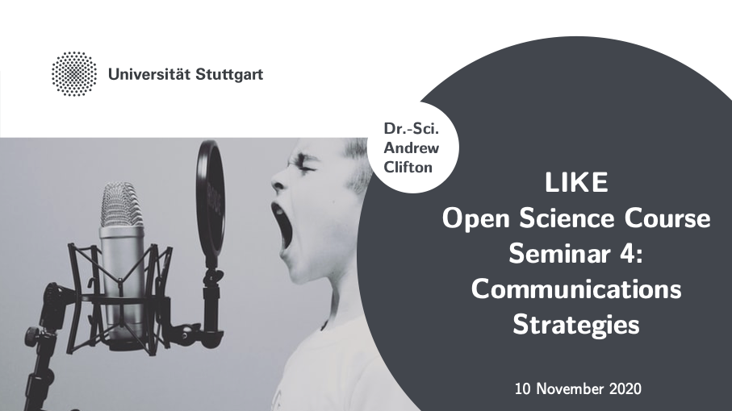

_The seminar was led by Andy Clifton, U. Stuttgart [ https://orcid.org/0000-0001-9698-5083](https://orcid.org/0000-0001-9698-5083)_

# Seminar 4: Communications Strategies
Notes written by Andy Clifton, U. Stuttgart [ https://orcid.org/0000-0001-9698-5083](https://orcid.org/0000-0001-9698-5083)

_These notes are based on the first course held in October 2020. Section numbers correspond to the sections [in the presentation accompanying the seminar](../beamer/main.pdf)._

## 1. Introduction

## 2. Recap

Open science is the movement to share and disseminate the results of scientific activities. It can be implemented partly by making the results of your science _FAIR_ (findable, accessible, interoperable, and reusable), and applying the R5 principles to your digital objects (code, data). See [the notes from Seminar 2](../03_seminar2/notes/notes.md) for more information.

## Summary
Your intellectual output usually belongs to someone, and so you have to take steps to make it open. You can do this by giving it an appropriate license. Clear licenses make it easy for others to build on your work and can also lead to commercial success. Finally, a clean framework for code and modular implementation can simplify the whole process of collaboration.

---

## For more information
- See [the notes from the previous seminar, on intellectual property](../../05_seminar3/notes/readme.md).

## Course progress
| Previous: [Self-study 3: "Implementing open science"](../../06_selfstudy4/readme.md) | [Course outline](../../readme.md#course-outline) | Next: [Selfstudy 4: "Communicate!"](../../08_selfstudy4/readme.md) |
| -- | -- | -- |
