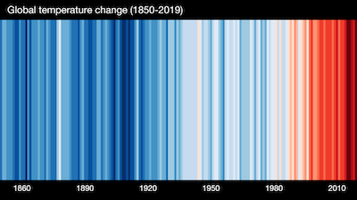
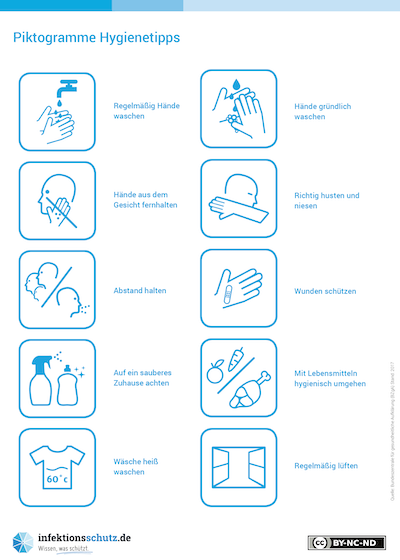

_The seminar was led by Andy Clifton, U. Stuttgart [ https://orcid.org/0000-0001-9698-5083](https://orcid.org/0000-0001-9698-5083)_

# Seminar 4: Communications Strategies
Notes written by Andy Clifton, U. Stuttgart [ https://orcid.org/0000-0001-9698-5083](https://orcid.org/0000-0001-9698-5083)

_These notes are based on the first course held in October 2020. Section numbers correspond to the sections [in the presentation accompanying the seminar](../beamer/main.pdf)._

## 1. Recap

Open science is the movement to share and disseminate the results of scientific activities. It can be implemented partly by making the results of your science _FAIR_ (findable, accessible, interoperable, and reusable), and applying the R5 principles to your digital objects (code, data). See [the notes from Seminar 2](../03_seminar2/notes/notes.md) for more information.

## 2. Introduction
> If no-one knows you did it, you didn't do it.

You can do the best science in the world, and do everything related to the FAIR principles and R5 right, but if no-one knows about it, it never happened.

So, how can STEM professionals tell people about what they did? This is where an effective communications strategy can help. 

Let's take the example of a STEM professional who has just written a paper. They've also generated a lot of data and some code, and in the spirit of open science they want to make it available to the world.

## 3. Telling people about your work

Telling people about your work means understanding more about why we communicate, what channels we have open to us, and how we can combine different approaches to create an effective communications strategy.

### Information overload
STEM professionals deal with a huge amount of information every day. This comes in many different forms, from traditional media - radio, TV - to online sources, to social media, e-mail, and advertising. As I sit here at my desk I am continually presented with information in the form of logos on my monitors, laptop, headphones, pens, pencils, and elsewhere. However, humans are great at filtering out extraneous information that doesn't matter at the time. There are probably good evolutionary advantages to this; there's no point in counting the blades of grass if some predator is just going to eat you...

Unfortunately, this same ability to filter out information works against a STEM professional who is tryin to get their material noticed. Professional communications can often just be part of the background noise and rarely become important enough to act upon.

Let's look at what makes people act on communications.

### Why do we communicate?
We communicate for one of three main purposes. These are:
- to inform;
- to make someone care;
- to make someone act.

We instinctively tailor our message to that goal, and adjust the balance between factual and emotional content, and the immediacy of the message. The same principles tend to hold regardless of whether the message is conveyed face-to-face or through some other media like a e-mail, phone call, or web page.

For example, informative content is usually communicated factually rather than emotionally. In contrast, communications that are intended to make someone act are more emotive than factual. They might also be coupled with simplified messages, bright colours, and very direct language. They also often speak of immediate issues, rather than something less tangible.

We can therefore speak of _informative_, _emotive_, and _provocative_ communications:

| Goal             | Factual content | Emotional content | Example                        |
|------------------|-----------------|-------------------|--------------------------------|
| to inform        | high            | low to none       | "the car is red"               |
| to make you care | middle          | mid to high       | "the car is coming toward you" |
| to make you act  | low to none     | high              | "run!"                         |

Let's take a look at some examples of how this works.

| Informative | Emotive     | Provocative   |
|-------------|-------------|---------------|
|  |            | |
| Annual average temperatures for the globe. Source: [Image by Ed Hawkins (University of Reading). Used under CC BY 4.0 license.](https://showyourstripes.info/) | source: Photo by [Mika Baumeister](https://unsplash.com/@mbaumi) on [https://unsplash.com](Unsplash) | Source: [German Federal Centre for Health Education (BZgA)](https://www.infektionsschutz.de/mediathek/infografiken.html) |

The reality is that STEM communications will then usually stay in the _informative_ part of the communications spectrum. This means that they rarely make people care, and even more rarely make people act. For our communications to become effective, we need to make people care, and we need to make them act.

For our STEM researcher, their goals cover all of the above:
- to inform people that they did this work, and that the data and code exist
- to make people care about it by making it relevant to them
- to make them act, for example by downloading the data or code.

### Matching the message to the channel to the audience
Not everyone cares about the same things. For example, a large group of STEM professionals is only likely to agree on generic issues (climate change is bad) and less on details (renewable energy or carbon sequestration). But if you choose a specific stakeholder group (wind energy professionals, or trade ministers), then it's likely that they might also agree on details. 

It's easier to reach these stakeholder groups - the _audience_ for your communications - if you choose the right way to reach them (the _channel_). They might have dedicated events that they attend, or use an email news group, or monitor a channel on a messaging service. Finding that channel will let you speak to that audience directly.

Once you work out how to reach your audience, you can communicate more precisely with them and can tailor the message to them. While your message to a larger group might have only be informative, you can make your message to this smaller group emotive or even provocative, because you know more about how the smaller group thinks.

So, it is essential when communicating to align:
- **the message** (the thing to be communicated)
- **the audience** (the people to inform or provoke).
- **the channel** (the media to use.) 

Our STEM professional is a STEM professional and so chooses the channels that are familiar to them. They choose a familiar communications mix:

| Social Media | Conference     | Journal   |
|-------------|-------------|---------------|
|  |            | |
| They use the _in your face_ social media platform to raise awareness of their work, posting a link to the paper and their next conference presentation. Photo by [Ben Kolde](https://unsplash.com/@benkolde) on [Unsplash](https://unsplash.com)  | They go to the _European Big Conference on Something Important_ and present their work to 200 attendees. Photo by [Joao Cruz](https://unsplash.com/@jcruzweb) on [Unsplash](https://unsplash.com) | And then they write a paper and publish it in the _Journal of Really Heavy Science_. Photo by [Annie Spratt](https://unsplash.com/@anniespratt) on [Unsplash](https://unsplash.com)|

### The "call to action" in STEM
You are probably familiar with the "buy now" button on your favorite online marketplace. These buttons are an integral part of the online experience. You've probably seen others, like "click here to find out what happened next" (sometimes called "clickbait"). These are all types of communication that are designed to get you to do something. As a result, they are known as "call to action" text.

The "call to action" also exists in the STEM field. But, as a STEM professional, your goals might be different. For example, you might want someone to do one of these...
1. Read your paper
1. Download something
1. Register for an event
1. Use your code

Our STEM professional didn't really have an explicit call to action. They thought that inviting someone to read a paper is the same as inviting them to use their code. But when they made a post about it on professional social media, nothing happened. They had some posts like "we're presenting next week", or "our paper has been published". Later, they talked to some people at a meeting and found out that no-one noticed there was code available. 

So, make sure that you are clear about what you are trying to do. If you want someone to use your code, don't say "here's my paper" and expect them to figure it out. Instead, be direct! Give them the link to the code and say "use my code to make your life easier".

### Effective communications is like selling something
The problem with communications is that you don't always know who your target audience really is, or how to reach them, or what will make them act. You're going to have to develop a _pipeline_ of people, converting or winnowing down interested people into people who care, and then filtering further down to find the people who will act. 

This means that our STEM researcher will probably have to target several different audiences before someone acts. For example:
- A post on professional social media might reach 1,000 people. Maybe 100 will find it relevant.
- Of the 100 who find it relevant (they are informed), maybe 10 will care enough to "like" it.
- Of those 10 people, 1 person might be interested enough to download something.

It's important at each stage to help the audience understand why something is relevant to them. The more relevant something is, the more likely you are to convert someone to taking the next step.

### Tell a good story
Now that we understand the mechanics of communication, we should think more about the content. We've already looked at the _call to action_, but what about the story behind it all?

Stories evolved to help us [make sense of the world around us and share that with others](https://smile.amazon.de/Origin-Stories-Evolution-Cognition-Fiction/dp/0674057112/). They offer us a way to put it in context and make it relevant and relatable for others. The same techniques that make a good story captivating could also be put to good work in communicating our science. Steal some story-telling approaches - have a hero and a villain, have a beginning, a middle, and an end, and keep it focussed. Apply the principle of [Chekhov's gun](https://en.wikipedia.org/wiki/Chekhov%27s_gun); if it's not relevant, don't mention it. And maybe most importantly, **remember the "wow!" factor** - make it exciting!

Photo by [Cedric Vandenberghe](https://unsplash.com/@cedericvandenberghe) on [Unsplash](https://unsplash.com).

### An Aside - Using social media
Social media (whether it's "for business" like LinkedIn, or something like Instagram) can be a great way to promote your work and build a brand. Some thoughts:

| Goal             | How?            |
|------------------|-----------------|
| grab attention   | <ul><li> Use an eye-catching image.</li><li>Work relevant hashtags in to the text that go from generic to precise, like _#windenergy_, _#whatever_, and _#blah_ to make sure your message gets picked up by the right people.</li></ul> |
| keep attention  |  <ul><li> Keep text short, sharp, and to the point.</li> <li>Don't get too philosophical or wistful - be direct.</li> <li> Use a spell check.</li> <li>Be relevant in the first 3-4 words. Instead of "We have just published a paper on _blah_...", try "_Blah_ can be really difficult because of... Our paper gives a new solution. Download it from ...", or something else that connects immediately with the audience and is slightly emotive.</li></ul> |
| convert attention to action | <ul><li> Get the reader to click on a link to a website where the interested reader can find out more, or do something useful. </li><li>Make sure that content is worth the click!</li></ul>|
| engage  | <ul><li> Answer people if they ask questions through this media.</li></ul>|

N.B. if you don't have anything to say, don't say it.

### Towards a communications strategy

We now see that our STEM researcher might need several different communications attempts before someone downloads and uses their code. This is why we need a communications strategy. 

A communications strategy is about choosing the right mix of audience, messages, and channel to populate that sales pipeline and convert interest into action. Usually, it would include the following:

- The overall goal
- The communications mix for several stages of the process and different stakeholder groups. For example:
    - Ideas for the audience, message, and channel for each stakeholder group
    - Goals for each stakeholder group
    - How to convert attention in to appropriate actions, for example the "calls to action" at different stages in the process.
- Success criteria

### Reviewing our STEM professional's approach
Our STEM professional had created their own communications strategy, but without really thinking it through. They had the usual mix:
1. They promoted their work through social media.
1. They presented it at a conference.
1. They wrote it up in a journal.

#### Would it have worked?
Would the communications strategy have resulted in anyone engaging with them? In reality, probably not. It's likely that the research would have been invisible, or that the message wouldn't have been heard over the noise. Why do I suspect this?
1. It's familiar. It's what everyone else does. There's nothing to grab attention and make it rise above the background.
1. There were no explicit calls to action.
1. They forgot to post links to their data.
1. The journal isn't open access, so people in industry that might use the results can't read them.
1. They can't add data sets or code to the paper anyway.

And then they got distracted by the next project.

#### What could they have done differently?
What could they have done differently? Let's try looking at this for an open science project. 
- First, remember that you want to raise awareness and make people act at several different points in the process of your research. This could be when you have created the data, when you have created the methods, and when you have got the results.
- Think about the goal for each step of the process.
- Give data, methods, and results their own publications and assign them a DOI.
- Use explicit calls to action, like "download our data from..."
- Make modular code and place it in repositories so that the code can be combined with other peoples' work more easily.

## Summary

You can get your science into the hands of people who can use by creating and using a communications strategy. An effective communications strategy focusses on specific audiences by careful choice of message and channel and gives them relevant, meaningful calls to action. 

## License
These notes are published under the [Creative Commons CC BY 4.0 license](https://creativecommons.org/licenses/by/4.0/)

---
## Seminars in this course
- Seminar 1: [Introducing Open Science](../../01_seminar1/notes/readme.md).
- Seminar 2: [Guiding principles](../../03_seminar2/notes/readme.md).
- Seminar 3: [Open Science and Intellectual Property](../../05_seminar3/notes/readme.md).
- Seminar 4: [Communications strategies](../../07_seminar4/notes/readme.md).
- Seminar 5: [What are data management plans and why do they matter?](../../10_seminar5/notes/readme.md).

## Course progress
| Previous: [Self-study 3: "Implementing open science"](../../06_selfstudy4/readme.md) | [Course outline](../../readme.md#course-outline) | Next: [Selfstudy 4: "Communicate!"](../../08_selfstudy4/readme.md) |
| -- | -- | -- |
